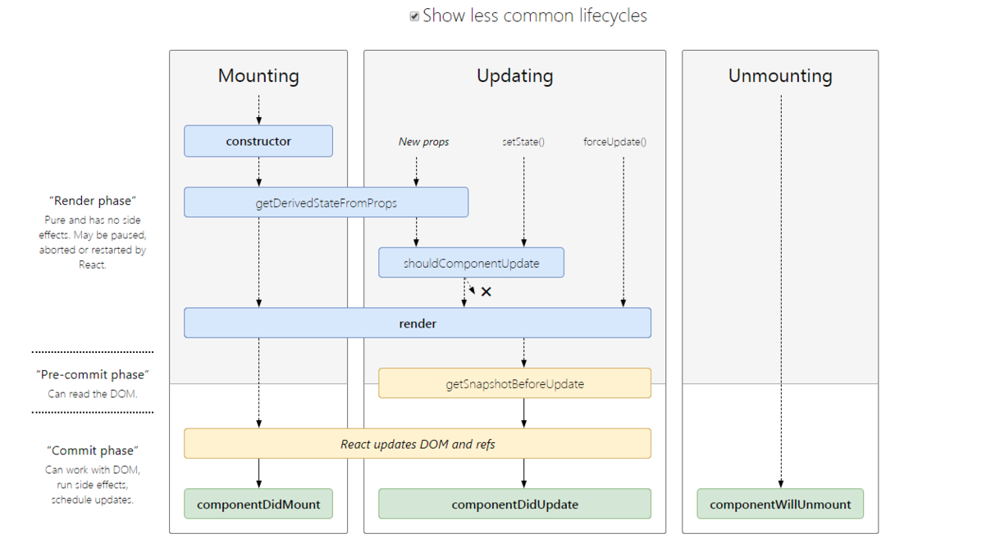

# react 面试题

### 1. 写React/Vue项目时，为什么要在列表组件中写key，作用是什么
+ 不带key，可以更高效的**就地复用**，diff速度也更快，但会隐藏一些副作用，比如不会产生过渡效果，或者某些节点绑定有数据状态，出现状态错位。
+ 带key的作用是：
1. 解决**就地复用**的一些副作用。
2. key是给每一个vnode的唯一id,可以依靠key,更准确, 更快的拿到oldVnode中对应的vnode节点，利用key的唯一性生成map对象来获取对应节点，比遍历方式更快。

### 2. react有哪些组件？
1. 函数/无状态/展示组件
+ 函数或无状态组件是一个纯函数，它可接受接受参数，并返回react元素。这些都是没有任何副作用的纯函数。这些组件没有状态或生命周期方法。
2. 类/有状态组件
+ 类或有状态组件具有状态和生命周期方可能通过setState()方法更改组件的状态。类组件是通过扩展React创建的。它在构造函数中初始化，也可能有子组件,
3. 受控组件
+ 受控组件是在 React 中处理输入表单的一种技术。表单元素通常维护它们自己的状态，而react则在组件的状态属性中维护状态。我们可以将两者结合起来控制输入表单。这称为受控组件。因此，在受控组件表单中，数据由React组件处理。
4. 非受控组件
+ 大多数情况下，建议使用受控组件。有一种称为非受控组件的方法可以通过使用Ref来处理表单数据。在非受控组件中，Ref用于直接从DOM访问表单值，而不是事件处理程序。
5. 容器组件
+ 容器组件是处理获取数据、订阅 redux 存储等的组件。它们包含展示组件和其他容器组件，但是里面从来没有html。
6. 高阶组件
+ 高阶组件是将组件作为参数并生成另一个组件的组件。 Redux connect是高阶组件的示例。 这是一种用于生成可重用组件的强大技术。

### 3. 什么是函数式编程？
+ 函数式编程是声明式编程的一部分。javascript中的函数是第一类公民，这意味着函数是数据，你可以像保存变量一样在应用程序中保存、检索和传递这些函数。
+ 函数式编程有如下核心概念：
1. 不可变性(Immutability)
+ 不可变性意味着不可改变。 在函数式编程中，你无法更改数据，也不能更改。 如果要改变或更改数据，则必须复制数据副本来更改。**Object.assign**
2. 纯函数
+ 纯函数是始终接受一个或多个参数并计算参数并返回数据或函数的函数。 它没有副作用，例如设置全局状态，更改应用程序状态，它总是将参数视为不可变数据。
3. 数据转换
+ 例如map、filter、reduce方法，所有这些函数都不改变现有的数据，而是返回新的数组或对象。
4. 高阶函数
+ Array.map，Array.filter和Array.reduce是高阶函数，因为它们将函数作为参数。
5. 递归
+ 递归是一种函数在满足一定条件之前调用自身的技术。
6. 组合
+ 在React中，我们将功能划分为小型可重用的纯函数，我们必须将所有这些可重用的函数放在一起，最终使其成为产品。 将所有较小的函数组合成更大的函数，最终，得到一个应用程序，这称为组合。

### 4. React 与 Angular 有何不同？
+ Angular是一个成熟的MVC框架，带有很多特定的特性，比如服务、指令、模板、模块、解析器等等。React是一个非常轻量级的库，它只关注MVC的视图部分。
+ Angular遵循两个方向的数据流，而React遵循从上到下的单向数据流。React在开发特性时给了开发人员很大的自由，例如，调用API的方式、路由等等。我们不需要包括路由器库，除非我们需要它在我们的项目。

### 5. 什么是Virtual DOM及其工作原理
+ 虚拟DOM只不过是真实 DOM 的 javascript对象表示。 与更新真实 DOM 相比，更新 javascript 对象更容易，更快捷。

### 6. 什么是 JSX
+ JSX是javascript的语法扩展。它就像一个拥有javascript全部功能的模板语言。它生成React元素，这些元素将在DOM中呈现。React建议在组件使用JSX。在JSX中，我们结合了javascript和HTML，并生成了可以在DOM中呈现的react元素。

### 7. React最新的生命周期是怎样的?
+ React 16之后有三个生命周期被废弃,官方计划在17版本完全删除这三个函数，只保留UNSAVE_前缀的三个函数，目的是为了向下兼容，但是对于开发者而言应该尽量避免使用他们，而是使用新增的生命周期函数替代它们
1. componentWillMount
2. componentWillReceiveProps
3. componentWillUpdate
+ 目前React 16.8 +的生命周期分为三个阶段,分别是挂载阶段、更新阶段、卸载阶段
+ **挂载阶段：**
1. constructor: 构造函数，最先被执行,我们通常在构造函数里初始化state对象或者给自定义方法绑定this。
2. getDerivedStateFromProps: static getDerivedStateFromProps(nextProps, prevState),这是个静态方法,当我们接收到新的属性想去修改我们state，可以使用getDerivedStateFromProps。
3. render: render函数是纯函数，只返回需要渲染的东西，不应该包含其它的业务逻辑,可以返回原生的DOM、React组件、Fragment、Portals、字符串和数字、Boolean和null等内容。
4. componentDidMount: 组件装载之后调用，此时我们可以获取到DOM节点并操作，比如对canvas，svg的操作，服务器请求，订阅都可以写在这个里面，但是记得在componentWillUnmount中取消订阅。
+ **更新阶段：**
1. getDerivedStateFromProps: 此方法在更新和挂载阶段都可能会调用。
2. shouldComponentUpdate: shouldComponentUpdate(nextProps, nextState),有两个参数nextProps和nextState，表示新的属性和变化之后的state，返回一个布尔值，true表示会触发重新渲染，false表示不会触发重新渲染，默认返回true,我们通常利用此生命周期来优化React程序性能
3. render: 更新阶段也会触发此生命周期
4. getSnapshotBeforeUpdate: getSnapshotBeforeUpdate(prevProps, prevState),这个方法在render之后，componentDidUpdate之前调用，有两个参数prevProps和prevState，表示之前的属性和之前的state，这个函数有一个返回值，会作为第三个参数传给componentDidUpdate，如果你不想要返回值，可以返回null，此生命周期必须与componentDidUpdate搭配使用
5. componentDidUpdate: componentDidUpdate(prevProps, prevState, snapshot),该方法在getSnapshotBeforeUpdate方法之后被调用，有三个参数prevProps，prevState，snapshot，表示之前的props，之前的state，和snapshot。第三个参数是getSnapshotBeforeUpdate返回的,如果触发某些回调函数时需要用到 DOM 元素的状态，则将对比或计算的过程迁移至 getSnapshotBeforeUpdate，然后在 componentDidUpdate 中统一触发回调或更新状态。
+ **卸载阶段：**
1. componentWillUnmount: 当我们的组件被卸载或者销毁了就会调用，我们可以在这个函数里去清除一些定时器，取消网络请求，清理无效的DOM元素等垃圾清理工作



+ 旧版本的生命周期


### 8. React的请求应该放在哪个生命周期中?
+ React的异步请求到底应该放在哪个生命周期里,有人认为在componentWillMount中可以提前进行异步请求,避免白屏,其实这个观点是有问题的.
+ 由于JavaScript中异步事件的性质，当您启动API调用时，浏览器会在此期间返回执行其他工作。当React渲染一个组件时，它不会等待componentWillMount它完成任何事情 - React继续前进并继续render,没有办法“暂停”渲染以等待数据到达。
+ 而且在componentWillMount请求会有一系列潜在的问题,首先,在服务器渲染时,如果在 componentWillMount 里获取数据，fetch data会执行两次，一次在服务端一次在客户端，这造成了多余的请求,其次,在React 16进行React Fiber重写后,componentWillMount可能在一次渲染中多次调用.
+ 目前官方推荐的异步请求是在componentDidmount中进行.

### 9. setState到底是异步还是同步?
+ 有时表现出异步,有时表现出同步
1. setState只在合成事件和钩子函数中是“异步”的，在原生事件和setTimeout 中都是同步的。
2. setState 的“异步”并不是说内部由异步代码实现，其实本身执行的过程和代码都是同步的，只是合成事件和钩子函数的调用顺序在更新之前，导致在合成事件和钩子函数中没法立马拿到更新后的值，形成了所谓的“异步”，当然可以通过第二个参数 setState(partialState, callback) 中的callback拿到更新后的结果。
3. setState 的批量更新优化也是建立在“异步”（合成事件、钩子函数）之上的，在原生事件和setTimeout 中不会批量更新，在“异步”中如果对同一个值进行多次setState，setState的批量更新策略会对其进行覆盖，取最后一次的执行，如果是同时setState多个不同的值，在更新时会对其进行合并批量更新。
+ 参考链接 [深入setState机制](https://github.com/sisterAn/blog/issues/26)

### 10. React组件通信如何实现?
1. 父组件向子组件通讯: 父组件可以向子组件通过传 props 的方式，向子组件进行通讯
2. 子组件向父组件通讯: props+回调的方式,父组件向子组件传递props进行通讯，此props为作用域为父组件自身的函数，子组件调用该函数，将子组件想要传递的信息，作为参数，传递到父组件的作用域中
3. 兄弟组件通信: 找到这两个兄弟节点共同的父节点,结合上面两种方式由父节点转发信息进行通信
4. 跨层级通信: Context设计目的是为了共享那些对于一个组件树而言是“全局”的数据，例如当前认证的用户、主题或首选语言,对于跨越多层的全局数据通过Context通信再适合不过
5. 发布订阅模式: 发布者发布事件，订阅者监听事件并做出反应,我们可以通过引入event模块进行通信
6. 全局状态管理工具: 借助Redux或者Mobx等全局状态管理工具进行通信,这种工具会维护一个全局状态中心Store,并根据不同的事件产生新的状态

### 11. 什么是高阶组件(HOC)？
+ 高阶组件就是一个 React 组件包裹着另外一个 React 组件
+ 两种实现方法：
1. **属性代理 Props Proxy**
```javascript
function ppHOC(WrappedComponent) {  
  return class PP extends React.Component {
    render() {
      return <WrappedComponent {...this.props}/>
    }  
  }
```
+ 使用 Props Proxy 可以做什么？
1. 操作 props
2. 通过 Refs 访问到组件实例
3. 提取 state
4. 用其他元素包裹 WrappedComponent,比如包裹样式。

2. **反向继承 Inheritance Inversion**
```javascript
function iiHOC(WrappedComponent) {
  return class Enhancer extends WrappedComponent {
    render() {
      return super.render()
    }
  }
}
```
Inheritance Inversion 允许 HOC 通过 this 访问到 WrappedComponent，意味着它可以访问到 state、props、组件生命周期方法和 render 方法。
+ 你可以用 Inheritance Inversion 做什么？
1. 渲染劫持
2. 操作 state

### 12. mixin、hoc、render props、react-hooks的优劣如何？
#### **Mixin的缺陷**
1. 组件与 Mixin 之间存在隐式依赖（Mixin 经常依赖组件的特定方法，但在定义组件时并不知道这种依赖关系）
2. 多个 Mixin 之间可能产生冲突（比如定义了相同的state字段）
3. Mixin 倾向于增加更多状态，这降低了应用的可预测性（The more state in your application, the harder it is to reason about it.），导致复杂度剧增
4. 隐式依赖导致依赖关系不透明，维护成本和理解成本迅速攀升：
#### **HOC相比Mixin的优势**
1. HOC通过外层组件通过 Props 影响内层组件的状态，而不是直接改变其 State不存在冲突和互相干扰,这就降低了耦合度
2. 不同于 Mixin 的打平+合并，HOC 具有天然的层级结构（组件树结构），这又降低了复杂度
#### **HOC的缺陷**
1. 扩展性限制: HOC 无法从外部访问子组件的 State因此无法通过shouldComponentUpdate滤掉不必要的更新,React 在支持 ES6 Class 之后提供了React.PureComponent来解决这个问题
2. Ref 传递问题: Ref 被隔断,后来的React.forwardRef 来解决这个问题
3. Wrapper Hell: HOC可能出现多层包裹组件的情况,多层抽象同样增加了复杂度和理解成本
4. 命名冲突: 如果高阶组件多次嵌套,没有使用命名空间的话会产生冲突,然后覆盖老属性
5. 不可见性: HOC相当于在原有组件外层再包装一个组件,你压根不知道外层的包装是啥,对于你是黑盒
#### **Render Props优点:**
1. 上述HOC的缺点Render Props都可以解决
#### **Render Props缺陷:**
1. 使用繁琐: HOC使用只需要借助装饰器语法通常一行代码就可以进行复用,Render Props无法做到如此简单
2. 嵌套过深: Render Props虽然摆脱了组件多层嵌套的问题,但是转化为了函数回调的嵌套
#### **React Hooks优点:**
1. 简洁: React Hooks解决了HOC和Render Props的嵌套问题,更加简洁
2. 解耦: React Hooks可以更方便地把 UI 和状态分离,做到更彻底的解耦
3. 组合: Hooks 中可以引用另外的 Hooks形成新的Hooks,组合变化万千
4. 函数友好: React Hooks为函数组件而生,从而解决了类组件的几大问题:
this 指向容易错误
分割在不同声明周期中的逻辑使得代码难以理解和维护
代码复用成本高（高阶组件容易使代码量剧增）
#### **React Hooks缺点:**
1. 额外的学习成本
2. 写法上有限制（不能出现在条件、循环中），并且写法限制增加了重构成本
3. 破坏了PureComponent、React.memo浅比较的性能优化效果（
4. 在闭包场景可能会引用到旧的state、props值
5. 内部实现上不直观（依赖一份可变的全局状态，不再那么“纯”）
6. React.memo并不能完全替代shouldComponentUpdate（因为拿不到 state change，只针对 props change）

### 13. 你对 Time Slice的理解?
1. React 在渲染（render）的时候，不会阻塞现在的线程
2. 如果你的设备足够快，你会感觉渲染是同步的
3. 如果你设备非常慢，你会感觉还算是灵敏的
4. 虽然是异步渲染，但是你将会看到完整的渲染，而不是一个组件一行行的渲染出来

### 14. redux的工作流程?
+ 核心概念如下：
1. Store：保存数据的地方，你可以把它看成一个容器，整个应用只能有一个Store。
2. State：Store对象包含所有数据，如果想得到某个时点的数据，就要对Store生成快照，这种时点的数据集合，就叫做State。
3. Action：State的变化，会导致View的变化。但是，用户接触不到State，只能接触到View。所以，State的变化必须是View导致的。Action就是View发出的通知，表示State应该要发生变化了。
4. Action Creator：View要发送多少种消息，就会有多少种Action。如果都手写，会很麻烦，所以我们定义一个函数来生成Action，这个函数就叫Action Creator。
5. Reducer：Store收到Action以后，必须给出一个新的State，这样View才会发生变化。这种State的计算过程就叫做Reducer。Reducer是一个函数，它接受Action和当前State作为参数，返回一个新的State。
6. dispatch：是View发出Action的唯一方法。
+ 然后我们过下整个工作流程
1. 首先，用户（通过View）发出Action，发出方式就用到了dispatch方法。
2. 然后，Store自动调用Reducer，并且传入两个参数：当前State和收到的Action，Reducer会返回新的State
3. State一旦有变化，Store就会调用监听函数，来更新View。

### 15. react-redux是如何工作的?
1. Provider: Provider的作用是从最外部封装了整个应用，并向connect模块传递store
2. connect: 负责连接React和Redux
+ 获取state: connect通过context获取Provider中的store，通过store.getState()获取整个store tree 上所有state
+ 包装原组件: 将state和action通过props的方式传入到原组件内部wrapWithConnect返回一个ReactComponent对象Connect，Connect重新render外部传入的原组件WrappedComponent，并把connect中传入的mapStateToProps, mapDispatchToProps与组件上原有的props合并后，通过属性的方式传给WrappedComponent
+ 监听store tree变化: connect缓存了store tree中state的状态,通过当前state状态和变更前state状态进行比较,从而确定是否调用this.setState()方法触发Connect及其子组件的重新渲染

### 16. 你对MVVM的理解?
+ **Model 层:** 对应数据层的域模型，它主要做域模型的同步。通过 Ajax/fetch 等 API 完成客户端和服务端业务 Model 的同步。在层间关系里，它主要用于抽象出 ViewModel 中视图的 Model。
+ **View 层:**作为视图模板存在，在 MVVM 里，整个 View 是一个动态模板。除了定义结构、布局外，它展示的是 ViewModel 层的数据和状态。View 层不负责处理状态，View 层做的是 数据绑定的声明、 指令的声明、 事件绑定的声明。
+ **ViewModel 层:**把 View 需要的层数据暴露，并对 View 层的 数据绑定声明、 指令声明、 事件绑定声明 负责，也就是处理 View 层的具体业务逻辑。ViewModel 底层会做好绑定属性的监听。当 ViewModel 中数据变化，View 层会得到更新；而当 View 中声明了数据的双向绑定（通常是表单元素），框架也会监听 View 层（表单）值的变化。一旦值变化，View 层绑定的 ViewModel 中的数据也会得到自动更新。


### 17. MVVM的优缺点?
+ **优点**
1. 分离视图（View）和模型（Model）,降低代码耦合，提高视图或者逻辑的重用性: 比如视图（View）可以独立于Model变化和修改，一个ViewModel可以绑定不同的"View"上，当View变化的时候Model可以不变，当Model变化的时候View也可以不变。你可以把一些视图逻辑放在一个ViewModel里面，让很多view重用这段视图逻辑
2. 提高可测试性: ViewModel的存在可以帮助开发者更好地编写测试代码
3. 自动更新dom: 利用双向绑定,数据更新后视图自动更新,让开发者从繁琐的手动dom中解放
+ **缺点**
1. Bug很难被调试: 因为使用双向绑定的模式，当你看到界面异常了，有可能是你View的代码有Bug，也可能是Model的代码有问题。数据绑定使得一个位置的Bug被快速传递到别的位置，要定位原始出问题的地方就变得不那么容易了。另外，数据绑定的声明是指令式地写在View的模版当中的，这些内容是没办法去打断点debug的
2. 一个大的模块中model也会很大，虽然使用方便了也很容易保证了数据的一致性，当时长期持有，不释放内存就造成了花费更多的内存
3. 对于大型的图形应用程序，视图状态较多，ViewModel的构建和维护的成本都会比较高

### 18. 什么是Virtual DOM?
+ Virtual DOM是对DOM的抽象,本质上是JavaScript对象,这个对象就是更加轻量级的对DOM的描述.

### 19. 为什么需要Virtual DOM?
+ DOM 操作 真正的问题在于每次操作都会触发布局的改变、DOM树的修改和渲染。
+ 在一个复杂的单页面应用中，经常会涉及到大量的DOM操作，这将引起多次计算，使得整个流程变得低效，这应该尽量避免。Virtual DOM这个抽象层真正的闪光点正在于此: 每当你想对视图进行一次更新，那些本该直接作用于真实DOM的改动，都会先作用于Virtual DOM，然后再将要改动的部分通知到真实DOM。这样可以大幅减少DOM操作带来的重计算步骤。

### 20. 为什么选择使用框架而不是原生?
1. 组件化: 其中以 React 的组件化最为彻底,甚至可以到函数级别的原子组件,高度的组件化可以是我们的工程易于维护、易于组合拓展。
2. 天然分层: JQuery 时代的代码大部分情况下是面条代码,耦合严重,现代框架不管是 MVC、MVP还是MVVM 模式都能帮助我们进行分层，代码解耦更易于读写。
3. 生态: 现在主流前端框架都自带生态,不管是数据流管理架构还是 UI 库都有成熟的解决方案。
4. 开发效率: 现代前端框架都默认自动更新DOM,而非我们手动操作,解放了开发者的手动DOM成本,提高开发效率,从根本上解决了UI 与状态同步问题.

### 21. 虚拟dom的优劣如何？
+ 优点:
1. **保证性能下限:** 虚拟DOM可以经过diff找出最小差异,然后批量进行patch,这种操作虽然比不上手动优化,但是比起粗暴的DOM操作性能要好很多,因此虚拟DOM可以保证性能下限
2. **无需手动操作DOM:** 虚拟DOM的diff和patch都是在一次更新中自动进行的,我们无需手动操作DOM,极大提高开发效率
3. **跨平台:** 虚拟DOM本质上是JavaScript对象,而DOM与平台强相关,相比之下虚拟DOM可以进行更方便地跨平台操作,例如服务器渲染、移动端开发等等
+ 缺点:
1. **无法进行极致优化:** 在一些性能要求极高的应用中虚拟DOM无法进行针对性的极致优化,比如VScode采用直接手动操作DOM的方式进行极端的性能优化

### 22. 虚拟 DOM 实现原理？
虚拟 DOM 的实现原理主要包括以下 3 部分：
+ **用 JavaScript 对象模拟真实 DOM 树，对真实 DOM 进行抽象；**
+ **diff 算法 — 比较两棵虚拟 DOM 树的差异；**
1. diff 算法用来比较两棵 Virtual DOM 树的差异，如果需要两棵树的完全比较，那么 diff 算法的时间复杂度为O(n^3)。但是在前端当中，你很少会跨越层级地移动 DOM 元素，所以 Virtual DOM 只会对同一个层级的元素进行对比，如下图所示， div 只会和同一层级的 div 对比，第二层级的只会跟第二层级对比，这样算法复杂度就可以达到 O(n)。
2. 在实际的代码中，会对新旧两棵树进行一个深度优先的遍历，这样每个节点都会有一个唯一的标记。
3. 在深度优先遍历的时候，每遍历到一个节点就把该节点和新的的树进行对比。如果有差异的话就记录到一个对象里面。
4. DOM 操作导致的差异类型包括以下几种：节点替换，顺序互换，属性更改，文本改变。
5. 使用动态规划算法实现字节点对比
+ **patch 算法 — 将两个虚拟 DOM 对象的差异应用到真正的 DOM 树。**
1. 深度优先遍历 DOM 树，因为步骤一所构建的 JavaScript 对象树和 render 出来真正的 DOM 树的信息、结构是一样的。所以我们可以对那棵 DOM 树也进行深度优先的遍历，遍历的时候从步骤二生成的 **patches** 对象中找出当前遍历的节点差异，如下相关代码所示：
2. 对原有 DOM 树进行 DOM 操作，我们根据不同类型的差异对当前节点进行不同的 DOM 操作 ，例如如果进行了节点替换，就进行节点替换 DOM 操作；如果节点文本发生了改变，则进行文本替换的 DOM 操作；以及子节点重排、属性改变等 DOM 操作。
3. DOM结构改变。

### 23. Fiber 是什么？有什么用？
+ 在 React 15 版本的时候，我们如果有组件需要更新的话，那么就会递归向下遍历整个虚拟 DOM 树来判断需要更新的地方。这种递归的方式 **弊端** 在于无法中断，必须更新完所有组件才会停止。这样的弊端会造成如果我们需要更新一些庞大的组件，那么在更新的过程中可能就会长时间阻塞主线程，从而造成用户的交互、动画的更新等等都不能及时响应。
+ React 的组件更新过程简而言之就是在持续调用函数的一个过程，这样的一个过程会形成一个虚拟的调用栈。假如我们控制这个调用栈的执行，把整个更新任务拆解开来，尽可能地将更新任务放到浏览器空闲的时候去执行，那么就能解决以上的问题。
+ 那么现在是时候介绍 Fiber 了。Fiber 重新实现了 React 的核心算法，带来了杀手锏增量更新功能。**它有能力将整个更新任务拆分为一个个小的任务，并且能控制这些任务的执行。**

### 24. 为什么需要调度？
+ 大家都知道 JS 和渲染引擎是一个互斥关系。如果 JS 在执行代码，那么渲染引擎工作就会被停止。假如我们有一个很复杂的复合组件需要重新渲染，那么调用栈可能会很长。
+ 调用栈过长，再加上如果中间进行了复杂的操作，就可能导致长时间阻塞渲染引擎带来不好的用户体验，调度就是来解决这个问题的。
+ React 会根据任务的优先级去分配各自的 expirationTime，在过期时间到来之前先去处理更高优先级的任务，并且高优先级的任务还可以打断低优先级的任务（因此会造成某些生命周期函数多次被执行），从而实现在不影响用户体验的情况下去分段计算更新（也就是时间分片）。