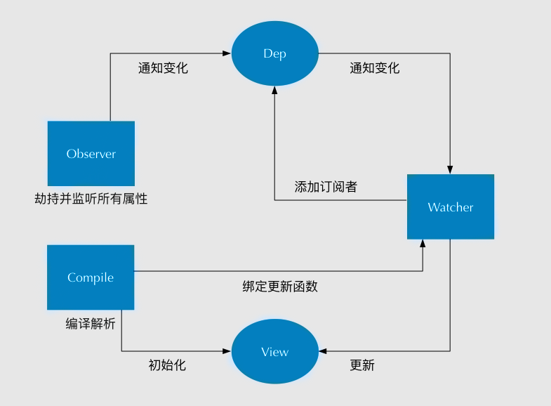

## vue面试题
参考：[Vue面试中，经常会被问到的面试题/Vue知识点整理](https://segmentfault.com/a/1190000016344599)

### 1.vue 动态路由加载
在vue-router对象中首先初始化公共路由，比如（404，login）等，然后在用户登陆成功，根据用户的角色信息，获取对应权限菜单信息menuList，并将后台返回的menuList转换成我们需要的router数据结构，然后通过vue-router2.2新添的router.addRouter(routes)方法，同时我们可以将转后的路由信息保存于vuex，这样我们可以在我们的SideBar组件中获取我们的全部路由信息，并且渲染我们的左侧菜单栏，让动态路由实现。

+ 登录：当用户填写完账号和密码后向服务端验证是否正确，验证通过之后，服务端会返回一个token，拿到token之后（我会将这个token存贮到cookie中，保证刷新页面后能记住用户登录状态），前端会根据token再去拉取一个 user_info 的接口来获取用户的详细信息（如用户权限，用户名等等信息）。
+ 权限验证：通过token获取用户对应的 role，动态根据用户的 role 算出其对应有权限的路由，通过router.addRoutes 动态挂载这些路由。


参考： [vue后台管理之动态加载路由的方法](https://www.jb51.net/article/145531.htm)

### 2. webpack中alias配置
作用:设置别名是为了让后续引用的地方减少路径的复杂度
```javascript
//index.vue 里，正常引用 A 组件：
import A from '../../components/a.vue'
//如果设置了 alias 后。
alias: {
  'vue$': 'vue/dist/vue.esm.js',
  '@': resolve('src')
}
import A from '@/components/a.vue'
```

### 3.vue如何实现双向绑定
+ vue数据双向绑定是通过 **数据劫持** 结合 **发布者-订阅者模式** 的方式来实现的.
+ vue是通过Object.defineProperty()来实现数据劫持的。它可以来控制一个对象属性的一些特有操作，比如读写权、是否可以枚举.有get和set两个方法。
+ 实现mvvm主要包含两个方面，数据变化更新视图，视图变化更新数据。视图更新数据其实可以通过事件监听即可，关键在于数据变化更新视图，通过Object.defineProperty( )对属性设置一个set函数，当数据改变了就会来触发这个函数，所以我们只要将一些需要更新的方法放在这里面就可以实现data更新view了。
+ 实现数据的双向绑定：
1. **实现一个监听器 Observer：** 对数据对象进行遍历，包括子属性对象的属性，利用 Object.defineProperty() 对属性都加上 setter 和 getter。这样的话，给这个对象的某个值赋值，就会触发 setter，那么就能监听到了数据变化
2. **实现一个解析器 Compile：** 解析 Vue 模板指令，将模板中的变量都替换成数据，然后初始化渲染页面视图，并将每个指令对应的节点绑定更新函数，添加监听数据的订阅者，一旦数据有变动，收到通知，调用更新函数进行数据更新。
3. **实现一个订阅者 Watcher：** Watcher 订阅者是 Observer 和 Compile 之间通信的桥梁 ，主要的任务是订阅 Observer 中的属性值变化的消息，当收到属性值变化的消息时，触发解析器 Compile 中对应的更新函数。
4. **实现一个订阅器 Dep：** 订阅器采用 发布-订阅 设计模式，用来收集订阅者 Watcher，对监听器 Observer 和 订阅者 Watcher 进行统一管理。


### 4. vue的生命周期
+ **beforecreated**  el、data、message未被初始化，此时可用于loading
+ **created** 完成了data、message的初始化
+ **beforeMount** 完成了el和data的初始化 ,但是el还是 {{message}}，这里就是应用的 Virtual DOM（虚拟Dom）技术，先把坑占住了。
+ **mounted** 完成挂载，渲染值。
+ **beforeUpdate** 可以监听到data的变化但是view层没有被重新渲染，view层的数据没有变化
+ **updated** 等到updated的时候 view层才被重新渲染，数据更新。
+ **beforeDestroy** 钩子函数在实例销毁之前调用。在这一步，实例仍然完全可用。
+ **destroyed** 钩子函数在Vue 实例销毁后调用。调用后，Vue 实例指示的所有东西都会解绑定，所有的事件监听器会被移除，所有的子实例也会被销毁。


### 5.vue的父子组件如何通信的
+ 父组件是通过props属性给子组件通信
+ 子组件通过触发事件来改变父组件的数据（this.$emit(method,data))。父组件通过监听子组件触发的事件，来调用方法，接收数据。
+ 兄弟组件的通信，采用观察者模式。新建一个第三方实例。
```JavaScript
//组件他哥
<div @click="ge"></div>
methods: {
    ge() {
        vm.$emit('blur','sichaoyun'); //触发事件
    }
}
//组件小弟
vm.$on('blur', (arg) => {
        this.test= arg; // 接收
});
```

### 6.Vue的路由实现：hash模式 和 history模式
+ **hash模式：** 在浏览器中符号“#”，#以及#后面的字符称之为hash，用window.location.hash读取；
+ 特点：hash虽然在URL中，但不被包括在HTTP请求中；用来指导浏览器动作，对服务端安全无用，hash不会重加载页面。hash 模式下，仅 hash 符号之前的内容会被包含在请求中，如 http://www.xxx.com，因此对于后端来说，即使没有做到对路由的全覆盖，也不会返回 404 错误。
+ **history模式：** history采用HTML5的新特性；且提供了两个新方法：pushState（），replaceState（）可以对浏览器历史记录栈进行修改，以及popState事件的监听到状态变更。
+ history 模式下，前端的 URL 必须和实际向后端发起请求的 URL 一致，如 http://www.xxx.com/items/id。后端如果缺少对 /items/id 的路由处理，将返回 404 错误。

### 7.vue-cli如何新增自定义指令？
```JavaScript
//创建局部指令
var app = new Vue({
    el: '#app',
    data: {    
    },
    // 创建指令(可以多个)
    directives: {
        // 指令名称
        dir1: {
            inserted(el) {
                el.style.width = '200px';
            }}}})
//创建全局指令
Vue.directive('dir2', {
    inserted(el) {
        console.log(el);
    }
})
//指令的使用
<div v-dir1></div>
```

### 8.vue如何自定义一个过滤器？
```JavaScript
<div id="app">
     <input type="text" v-model="msg" />
     {{msg| capitalize }}
</div>

var vm=new Vue({
    el:"#app",
    data:{
        msg:''
    },
    filters: {
      capitalize: function (value) {
        if (!value) return ''
        value = value.toString()
        return value.charAt(0).toUpperCase() + value.slice(1)
      }
    }
})
```

### 9.对keep-alive 的了解？
+ keep-alive是 Vue 内置的一个组件，可以使被包含的组件保留状态，或避免重新渲染。
+ 在vue 2.1.0 版本之后，keep-alive新加入了两个属性: include(包含的组件缓存) 与 exclude(排除的组件不缓存，优先级大于include) 。

### 10. vue中 key 值的作用？
+ 当 Vue.js 用 v-for 正在更新已渲染过的元素列表时，它默认用“就地复用”策略。如果数据项的顺序被改变，Vue 将不会移动 DOM 元素来匹配数据项的顺序， 而是简单复用此处每个元素，并且确保它在特定索引下显示已被渲染过的每个元素。key的作用主要是为了高效的更新虚拟DOM。

### 11.什么是vue的计算属性？
在模板中放入太多的逻辑会让模板过重且难以维护，在需要对数据进行复杂处理，且可能多次使用的情况下，尽量采取计算属性的方式。好处：①使得数据处理结构清晰；②依赖于数据，数据更新，处理结果自动更新；③计算属性内部this指向vm实例；④在template调用时，直接写计算属性名即可；⑤常用的是getter方法，获取数据，也可以使用set方法改变数据；⑥相较于methods，不管依赖的数据变不变，methods都会重新计算，但是依赖数据不变的时候computed从缓存中获取，不会重新计算。

### 12. vuex原理
+ vuex的store有State、 Getter、Mutation 、Action、 Module五种属性；
+ **state** 为单一状态树，在state中需要定义我们所需要管理的数组、对象、字符串等等
+ **getters** 类似vue的计算属性，主要用来过滤一些数据。
+ **mutation** 更改store中state状态的唯一方法就是提交mutation，store.commit。
+ **action** actions可以理解为通过将mutations里面处里数据的方法变成可异步的处理数据的方法，简单的说就是异步操作数据。view 层通过 store.dispath 来分发 action。
+ **module** module其实只是解决了当state中很复杂臃肿的时候，module可以将store分割成模块，每个模块中拥有自己的state、mutation、action和getter。

### 13. vue数据双向绑定
```JavaScript
<body>
    <div id="app">
    <input type="text" id="txt">
    <p id="show"></p>
</div>
</body>
<script type="text/javascript">
    var obj = {}
    Object.defineProperty(obj, 'txt', {
        get: function () {
            return obj
        },
        set: function (newValue) {
            document.getElementById('txt').value = newValue
            document.getElementById('show').innerHTML = newValue
        }
    })
    document.addEventListener('keyup', function (e) {
        obj.txt = e.target.value
    })
</script>
```

### 14. 父子组件如何通信，兄弟组件如何通信
1. props/$emit+v-on: 通过props将数据自上而下传递，而通过$emit和v-on来向上传递信息。
2. EventBus: 通过EventBus进行信息的发布与订阅。这种方法通过一个空的 Vue 实例作为中央事件总线（事件中心），用它来触发事件和监听事件，从而实现任何组件间的通信，包括父子、隔代、兄弟组件。
3. vuex: 是全局数据管理库，可以通过vuex管理全局的数据流。
4. $attrs/$listeners: Vue2.4中加入的$attrs/$listeners可以进行跨级的组件通信
5. provide/inject：以允许一个祖先组件向其所有子孙后代注入一个依赖，不论组件层次有多深，并在起上下游关系成立的时间里始终生效，这成为了跨组件通信的基础

### 15. Proxy与Object.defineProperty的优劣对比?
+ **Object.defineProperty的缺点**
1. 无法监听数组变化。Vue的文档提到了Vue是可以检测到数组变化的，但是只有以下八种方法,vm.items[indexOfItem] = newValue这种是无法检测的。
2. 只能劫持对象的属性,因此我们需要对每个对象的每个属性进行遍历，如果属性值也是对象那么需要深度遍历,显然能劫持一个完整的对象是更好的选择。
+ **Proxy的优点：**
1. Proxy可以直接监听对象而非属性
2. Proxy可以直接监听数组的变化
3. Proxy有多达13种拦截方法,不限于apply、ownKeys、deleteProperty、has等等是Object.defineProperty不具备的
4. Proxy返回的是一个新对象,我们可以只操作新的对象达到目的,而Object.defineProperty只能遍历对象属性直接修改
5. Proxy作为新标准将受到浏览器厂商重点持续的性能优化，也就是传说中的新标准的性能红利。
+ **Object.defineProperty的优点 && Proxy的缺点**
1. 兼容性好，支持 IE9，而 Proxy 的存在浏览器兼容性问题,而且无法用 polyfill 磨平，因此 Vue 的作者才声明需要等到下个大版本( 3.0 )才能用 Proxy 重写。

### 16. Vue 的父组件和子组件生命周期钩子函数执行顺序？
Vue 的父组件和子组件生命周期钩子函数执行顺序可以归类为以下 4 部分：
+ **加载渲染过程**：
+ 父 beforeCreate -> 父 created -> 父 beforeMount -> 子 beforeCreate -> 子 created -> 子 beforeMount -> 子 mounted -> 父 mounted
+ **子组件更新过程**
+ 父 beforeUpdate -> 子 beforeUpdate -> 子 updated -> 父 updated
+ **父组件更新过程**
+ 父 beforeUpdate -> 父 updated
+ **销毁过程**
+ 父 beforeDestroy -> 子 beforeDestroy -> 子 destroyed -> 父 destroyed

### 17. 在哪个生命周期内调用异步请求？
+ 可以在钩子函数 created、beforeMount、mounted 中进行调用，因为在这三个钩子函数中，data 已经创建，可以将服务端端返回的数据进行赋值。但是本人推荐在 created 钩子函数中调用异步请求，因为在 created 钩子函数中调用异步请求有以下优点：
1. 能更快获取到服务端数据，减少页面 loading 时间；
2. ssr 不支持 beforeMount 、mounted 钩子函数，所以放在 created 中有助于一致性；

### 18. 父组件可以监听到子组件的生命周期吗？
+ 比如有父组件 Parent 和子组件 Child，如果父组件监听到子组件挂载 mounted 就做一些逻辑处理，可以通过以下写法实现：
```javascript
// Parent.vue
<Child @mounted="doSomething"/>
    
// Child.vue
mounted() {
  this.$emit("mounted");
}
```
+ 以上需要手动通过 $emit 触发父组件的事件，更简单的方式可以在父组件引用子组件时通过 @hook 来监听即可，如下所示：
```javascript
//  Parent.vue
<Child @hook:mounted="doSomething" ></Child>

doSomething() {
   console.log('父组件监听到 mounted 钩子函数 ...');
},
    
//  Child.vue
mounted(){
   console.log('子组件触发 mounted 钩子函数 ...');
},    
    
// 以上输出顺序为：
// 子组件触发 mounted 钩子函数 ...
// 父组件监听到 mounted 钩子函数 ...     
```

### 19. 谈谈你对 keep-alive 的了解？
+ keep-alive 是 Vue 内置的一个组件，可以使被包含的组件保留状态，避免重新渲染 ，其有以下特性：
1. 一般结合路由和动态组件一起使用，用于缓存组件；
2. 提供 include 和 exclude 属性，两者都支持字符串或正则表达式， include 表示只有名称匹配的组件会被缓存，exclude 表示任何名称匹配的组件都不会被缓存 ，其中 exclude 的优先级比 include 高；
3. 对应两个钩子函数 activated 和 deactivated ，当组件被激活时，触发钩子函数 activated，当组件被移除时，触发钩子函数 deactivated。

### 20. 组件中 data 为什么是一个函数？
因为组件是用来复用的，且 JS 里对象是引用关系，如果组件中 data 是一个对象，那么这样作用域没有隔离，子组件中的 data 属性值会相互影响，如果组件中 data 选项是一个函数，那么每个实例可以维护一份被返回对象的独立的拷贝，组件实例之间的 data 属性值不会互相影响；而 new Vue 的实例，是不会被复用的，因此不存在引用对象的问题

### 21. 使用过 Vue SSR 吗？说说 SSR？
+ SSR大致的意思就是vue在客户端将标签渲染成的整个 html 片段的工作在服务端完成，服务端形成的html 片段直接返回给客户端这个过程就叫做**服务端渲染**。
+ 服务端渲染 SSR 的优缺点如下：
+ **优点：**
1. 更好的 SEO： 因为 SPA 页面的内容是通过 Ajax 获取，而搜索引擎爬取工具并不会等待 Ajax 异步完成后再抓取页面内容，所以在 SPA 中是抓取不到页面通过 Ajax 获取到的内容；而 SSR 是直接由服务端返回已经渲染好的页面（数据已经包含在页面中），所以搜索引擎爬取工具可以抓取渲染好的页面；
2. 更快的内容到达时间（首屏加载更快）： SPA 会等待所有 Vue 编译后的 js 文件都下载完成后，才开始进行页面的渲染，文件下载等需要一定的时间等，所以首屏渲染需要一定的时间；SSR 直接由服务端渲染好页面直接返回显示，无需等待下载 js 文件及再去渲染等，所以 SSR 有更快的内容到达时间；
+ **缺点：**
1. 更多的开发条件限制： 例如服务端渲染只支持 beforCreate 和 created 两个钩子函数，这会导致一些外部扩展库需要特殊处理，才能在服务端渲染应用程序中运行；并且与可以部署在任何静态文件服务器上的完全静态单页面应用程序 SPA 不同，服务端渲染应用程序，需要处于 Node.js server 运行环境；
2. 更多的服务器负载：在 Node.js  中渲染完整的应用程序，显然会比仅仅提供静态文件的  server 更加大量占用CPU 资源 (CPU-intensive - CPU 密集)，因此如果你预料在高流量环境 ( high traffic ) 下使用，请准备相应的服务器负载，并明智地采用缓存策略。

### 22. 能说下 vue-router 中常用的 hash 和 history 路由模式实现原理吗？
+ **hash 模式的实现原理**
1. URL 中 hash 值只是客户端的一种状态，也就是说当向服务器端发出请求时，hash 部分不会被发送；
2. hash 值的改变，都会在浏览器的访问历史中增加一个记录。因此我们能通过浏览器的回退、前进按钮控制hash 的切换；
3. 可以通过 a 标签，并设置 href 属性，当用户点击这个标签后，URL 的 hash 值会发生改变；或者使用  JavaScript 来对 loaction.hash 进行赋值，改变 URL 的 hash 值；
4. 我们可以使用 hashchange 事件来监听 hash 值的变化，从而对页面进行跳转（渲染）。
+ **history 模式的实现原理**
1. HTML5 提供了 History API 来实现 URL 的变化。其中做最主要的 API 有以下两个：history.pushState() 和 history.repalceState()。这两个 API 可以在不进行刷新的情况下，操作浏览器的历史纪录。唯一不同的是，前者是新增一个历史记录，后者是直接替换当前的历史记录，如下所示：
2. 我们可以使用 popstate  事件来监听 url 的变化，从而对页面进行跳转（渲染）；
3. history.pushState() 或 history.replaceState() 不会触发 popstate 事件，这时我们需要手动触发页面跳转（渲染）。

### 23. Vue 怎么用 vm.$set() 解决对象新增属性不能响应的问题 ？
受现代 JavaScript 的限制 ，Vue 无法检测到对象属性的添加或删除。由于 Vue 会在初始化实例时对属性执行 getter/setter 转化，所以属性必须在 data 对象上存在才能让 Vue 将它转换为响应式的。但是 Vue 提供了 Vue.set (object, propertyName, value) / vm.$set (object, propertyName, value)  来实现为对象添加响应式属性。
```javascript
export function set (target: Array<any> | Object, key: any, val: any): any {
  // target 为数组  
  if (Array.isArray(target) && isValidArrayIndex(key)) {
    // 修改数组的长度, 避免索引>数组长度导致splcie()执行有误
    target.length = Math.max(target.length, key)
    // 利用数组的splice变异方法触发响应式  
    target.splice(key, 1, val)
    return val
  }
  // key 已经存在，直接修改属性值  
  if (key in target && !(key in Object.prototype)) {
    target[key] = val
    return val
  }
  const ob = (target: any).__ob__
  // target 本身就不是响应式数据, 直接赋值
  if (!ob) {
    target[key] = val
    return val
  }
  // 对属性进行响应式处理
  defineReactive(ob.value, key, val)
  ob.dep.notify()
  return val
}
```
1. 如果目标是数组，直接使用数组的 splice 方法触发响应式；
2. 如果目标是对象，会先判读属性是否存在、对象是否是响应式，最终如果要对属性进行响应式处理，则是通过调用  defineReactive 方法进行响应式处理（ defineReactive 方法就是  Vue 在初始化对象时，给对象属性采用 Object.defineProperty 动态添加 getter 和 setter 的功能所调用的方法）

### 24. 说说你对 SPA 单页面的理解，它的优缺点分别是什么？
+ SPA（ single-page application ）仅在 Web 页面初始化时加载相应的 HTML、JavaScript 和 CSS。一旦页面加载完成，SPA 不会因为用户的操作而进行页面的重新加载或跳转；取而代之的是利用路由机制实现 HTML 内容的变换，UI 与用户的交互，避免页面的重新加载。
+ **优点**：
1. 用户体验好、快，内容的改变不需要重新加载整个页面，避免了不必要的跳转和重复渲染；
2. 基于上面一点，SPA 相对对服务器压力小；
3. 前后端职责分离，架构清晰，前端进行交互逻辑，后端负责数据处理；
+ **缺点**：
1. 初次加载耗时多：为实现单页 Web 应用功能及显示效果，需要在加载页面的时候将 JavaScript、CSS 统一加载，部分页面按需加载；
2. 前进后退路由管理：由于单页应用在一个页面中显示所有的内容，所以不能使用浏览器的前进后退功能，所有的页面切换需要自己建立堆栈管理；
3. SEO 难度较大：由于所有的内容都在一个页面中动态替换显示，所以在 SEO 上其有着天然的弱势。

### 25. v-show 与 v-if 有什么区别？
1. v-if 是真正的条件渲染，因为它会确保在切换过程中条件块内的事件监听器和子组件适当地被销毁和重建；也是惰性的：如果在初始渲染时条件为假，则什么也不做——直到条件第一次变为真时，才会开始渲染条件块。
2. v-show 就简单得多——不管初始条件是什么，元素总是会被渲染，并且只是简单地基于 CSS 的 “display” 属性进行切换。
3. 所以，v-if 适用于在运行时很少改变条件，不需要频繁切换条件的场景；v-show 则适用于需要非常频繁切换条件的场景。

### 26. computed 和 watch 的区别和运用的场景？
+ **computed：**  是计算属性，依赖其它属性值，并且 computed 的值有缓存，只有它依赖的属性值发生改变，下一次获取 computed 的值时才会重新计算 computed  的值；当我们需要进行数值计算，并且依赖于其它数据时，应该使用 computed，因为可以利用 computed 的缓存特性，避免每次获取值时，都要重新计算；
+ **watch：**  更多的是「观察」的作用，类似于某些数据的监听回调 ，每当监听的数据变化时都会执行回调进行后续操作；当我们需要在数据变化时执行异步或开销较大的操作时，应该使用 watch，使用 watch 选项允许我们执行异步操作 ( 访问一个 API )，限制我们执行该操作的频率，并在我们得到最终结果前，设置中间状态。这些都是计算属性无法做到的。

### 27. Vue 的父组件和子组件生命周期钩子函数执行顺序？
+ 加载渲染过程： 父 beforeCreate -> 父 created -> 父 beforeMount -> 子 beforeCreate -> 子 created -> 子 beforeMount -> 子 mounted -> 父 mounted
+ 子组件更新过程： 父 beforeUpdate -> 子 beforeUpdate -> 子 updated -> 父 updated
+ 父组件更新过程： 父 beforeUpdate -> 父 updated
+ 销毁过程： 父 beforeDestroy -> 子 beforeDestroy -> 子 destroyed -> 父 destroyed

### 28. 你有对 Vue 项目进行哪些优化？
+ **代码层面的优化**
- [ ] v-if 和 v-show 区分使用场景
- [ ] computed 和 watch  区分使用场景
- [ ] v-for 遍历必须为 item 添加 key，且避免同时使用 v-if
- [ ] 长列表性能优化
- [ ] 事件的销毁
- [ ] 图片资源懒加载
- [ ] 路由懒加载
- [ ] 第三方插件的按需引入
- [ ] 优化无限列表性能
- [ ] 服务端渲染 SSR or 预渲染
+ **Webpack 层面的优化**
- [ ] Webpack 对图片进行压缩
- [ ] 减少 ES6 转为 ES5 的冗余代码
- [ ] 提取公共代码
- [ ] 模板预编译
- [ ] 提取组件的 CSS
- [ ] 优化 SourceMap
- [ ] 构建结果输出分析
- [ ] Vue 项目的编译优化
+ **基础的 Web 技术的优化**
- [ ] 开启 gzip 压缩
- [ ] 浏览器缓存
- [ ] CDN 的使用
- [ ] 使用 Chrome Performance 查找性能瓶颈

### 29. 对于即将到来的 vue3.0 特性你有什么了解的吗？
Vue 3.0 正走在发布的路上，Vue 3.0 的目标是让 Vue 核心变得更小、更快、更强大，因此 Vue 3.0 增加以下这些新特性：

+ **监测机制的改变**

3.0 将带来基于代理 Proxy 的 observer 实现，提供全语言覆盖的反应性跟踪。这消除了 Vue 2 当中基于 Object.defineProperty 的实现所存在的很多限制：
1. 只能监测属性，不能监测对象
2. 检测属性的添加和删除；
3. 检测数组索引和长度的变更；
4. 支持 Map、Set、WeakMap 和 WeakSet。

新的 observer 还提供了以下特性：
1. 用于创建 observable 的公开 API。这为中小规模场景提供了简单轻量级的跨组件状态管理解决方案。
2. 默认采用惰性观察。在 2.x 中，不管反应式数据有多大，都会在启动时被观察到。如果你的数据集很大，这可能会在应用启动时带来明显的开销。在 3.x 中，只观察用于渲染应用程序最初可见部分的数据。
3. 更精确的变更通知。在 2.x 中，通过 Vue.set 强制添加新属性将导致依赖于该对象的 watcher 收到变更通知。在 3.x 中，只有依赖于特定属性的 watcher 才会收到通知。
4. 不可变的 observable：我们可以创建值的“不可变”版本（即使是嵌套属性），除非系统在内部暂时将其“解禁”。这个机制可用于冻结 prop 传递或 Vuex 状态树以外的变化。
5. 更好的调试功能：我们可以使用新的 renderTracked 和 renderTriggered 钩子精确地跟踪组件在什么时候以及为什么重新渲染。

+ **模板**

模板方面没有大的变更，只改了作用域插槽，2.x 的机制导致作用域插槽变了，父组件会重新渲染，而 3.0 把作用域插槽改成了函数的方式，这样只会影响子组件的重新渲染，提升了渲染的性能。

同时，对于 render 函数的方面，vue3.0 也会进行一系列更改来方便习惯直接使用 api 来生成 vdom 。

+ **对象式的组件声明方式**

vue2.x 中的组件是通过声明的方式传入一系列 option，和 TypeScript 的结合需要通过一些装饰器的方式来做，虽然能实现功能，但是比较麻烦。3.0 修改了组件的声明方式，改成了类式的写法，这样使得和 TypeScript 的结合变得很容易。

此外，vue 的源码也改用了 TypeScript 来写。其实当代码的功能复杂之后，必须有一个静态类型系统来做一些辅助管理。现在 vue3.0 也全面改用 TypeScript 来重写了，更是使得对外暴露的 api 更容易结合 TypeScript。静态类型系统对于复杂代码的维护确实很有必要。

+ **其它方面的更改**

vue3.0 的改变是全面的，上面只涉及到主要的 3 个方面，还有一些其他的更改：

1. 支持自定义渲染器，从而使得 weex 可以通过自定义渲染器的方式来扩展，而不是直接 fork 源码来改的方式。
2. 支持 Fragment（多个根节点）和 Protal（在 dom 其他部分渲染组建内容）组件，针对一些特殊的场景做了处理。
3. 基于 treeshaking 优化，提供了更多的内置功能。


